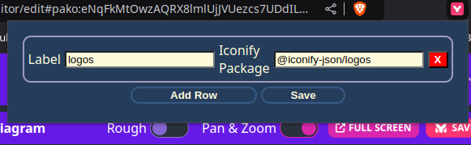
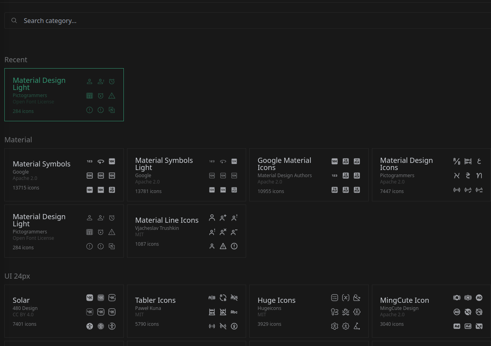
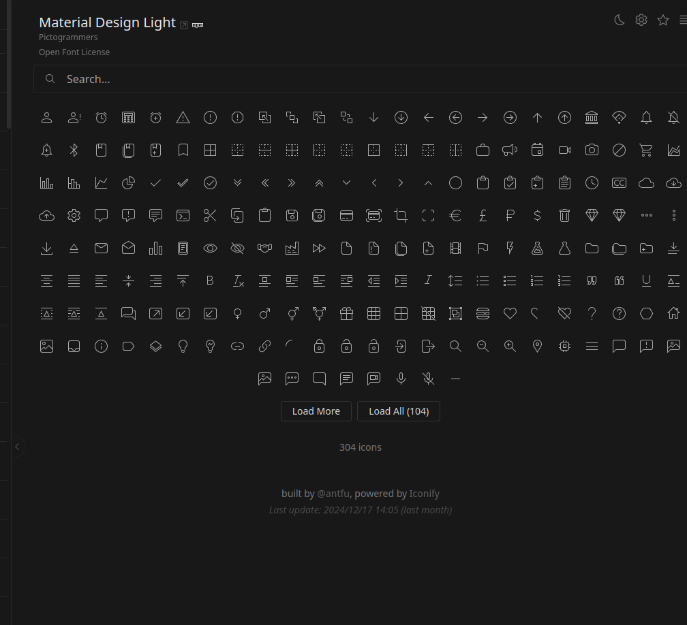
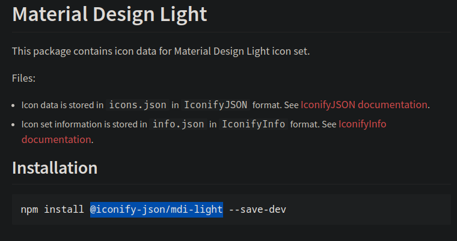

# mermaid-extension
Extension that allows to import your own icons and visualize them on mermaid online editors.

## Introduction
This extension allows you to extend the usage of [mermaid live editor](https://mermaid.live/), the official application allows you to add your own icons from [icones](https://icones.js.org/), however this is only possible if you install the app locally. This is said in the their official documentation ([here](https://mermaid.js.org/config/icons.html)).

With the extension you can import your own logos and use them within the live app. Nevertheless, currently it only works on my forked version of it [here](https://noobtolinux.github.io/mermaid-live-editor/).

## Usage
Once you install the app from the marketplace, you will have the extension popup just like the image:

* ***Label***: the label that you will use in the app text editor.
* ***Iconify package*** The iconify package with the icons ([Official example]('https://unpkg.com/@iconify-json/logos@1/icons.json')) and must start with https://unpkg.com/ and end with .json for the extension to work.

You will start without any rows, you can add one by pressing "Add row", and you will need to click on "Save" to save them (There is no animation, to prove it was saved, close and open the popup again, or click outside and open it again). Always locally (on your computer).

And that is all, if you go to my version of it, it will work as [documented](https://mermaid.js.org/syntax/architecture.html).

## How to get new icons

Once you have chosen your icons from the [page](https://icones.js.org/) you need to do the next steps:

### Example

1. Choose Icon pack.

2. Click on the npm link. It will open a new tab.

3. Copy the package name (the highlighted text).

4. Paste the package on the input of the popup (Iconify package).
5. Click on save.
6. Recharge the page.

## App documentation

* *assets folder*, it has the images.
* *popup folder*, it has the functionality for the popup (what appears when you click on the extension)
* **content.js**: Currently unused.
* **inject.js**: What is injected in the live editor page.
  * It just injects an html div with the content of the popup.

